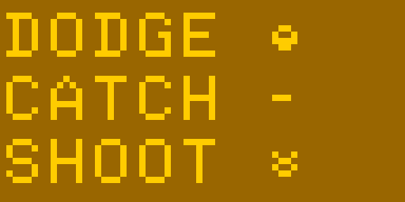

&nbsp;  

# Dodge Catch Shoot

### [itch.io page](https://miratha.itch.io/dodge-catch-shoot)

  
&nbsp;  
&nbsp;

This was my entry for [Octojam 10](https://itch.io/jam/octojam-10). Octojam was an annual Chip-8 jam that took place
every October. Octojam [has ended](https://beyondloom.com/blog/octojam.html), but it has left a legacy of content
spanning 10 years.  
&nbsp;  

The VCS I used during development was to frequently save a current copy of the source file. I've sorted through those
files and moved a few of them here to see my progress.  
&nbsp;  

I would like to revisit this game in the future, probably a complete rewrite using XO-Chip instructions.  
&nbsp;  

* [01](./dodge-catch-shoot-01.8o) ([open in Octo](https://johnearnest.github.io/Octo/index.html?key=USdi7-Cz))  
Move a sprite around by clearing the screen before every draw  

* [02](./dodge-catch-shoot-02.8o) ([open in Octo](https://johnearnest.github.io/Octo/index.html?key=FNCav6lT))  
Switch to XOR to move sprite (horizontal and vertical)

* [03](./dodge-catch-shoot-03.8o) ([open in Octo](https://johnearnest.github.io/Octo/index.html?key=LNx1MAnl))  
Modify sprite movement handling, add diagonal moves

* [04](./dodge-catch-shoot-04.8o) ([open in Octo](https://johnearnest.github.io/Octo/index.html?key=xPPrAb0N))  
Add ship movement speed limiter and register save/load

* [05](./dodge-catch-shoot-05.8o) ([open in Octo](https://johnearnest.github.io/Octo/index.html?key=22C7L1Wo))  
Refine player movement, add first falling rocks

* [06](./dodge-catch-shoot-06.8o) ([open in Octo](https://johnearnest.github.io/Octo/index.html?key=E-09Frv3))  
Get falling objects working and add all 3 types

* [07](./dodge-catch-shoot-07.8o) ([open in Octo](https://johnearnest.github.io/Octo/index.html?key=41EXLzL3))  
Change sprites and add laser to shoot objects

* [08](./dodge-catch-shoot-08.8o) ([open in Octo](https://johnearnest.github.io/Octo/index.html?key=n9oPl_wW))  
Implement collisions for catching and ship destruction

* [Release v1.1](./dodge-catch-shoot-1.1-octo.8o) ([open in Octo](https://johnearnest.github.io/Octo/index.html?key=eBdNMAl6))  
Add score (in hex) and limited player lives  
&nbsp;  
&nbsp;  

## A few notes about this game
I made use of the Octo settings `load and store operations leave i unchanged` and `clip sprites at screen edges instead of wrapping`
to simplify the development.

It was designed to run at 500 cycles/frame, but I believe it could be tweaked to work at 200. It wouldn't be playable on original
hardware, there is too much going on and too much inefficient code.

The ability to move up is currently pointless, I planned to add a score multiplier the higher up you are, but never got that far.

The player is drawn in an XOR fashion, but the falling objects are each erased and redrawn individually. I use the redraw of the objects to determine collision with the player. I thought about switching those for performance, but that idea came too late.  

The laser is the only thing using the delay timer (during gameplay), it's used to make sure the laser remains on the screen long enough to be seen. The falling rocks and player movement each have their own timer values (incrementing a variable). All three timers are balanced for 500 cycles/frame. It's not the best approach.  

There is a bug I haven't tried to fix: the player is allowed to move faster than the falling rocks, so the ship can move into a falling object and not be detected immediately. If a fire command is processed before the rocks are moved (and collision detected) the program is unable to locate the object the laser hit and shows the error screen.  
&nbsp;  